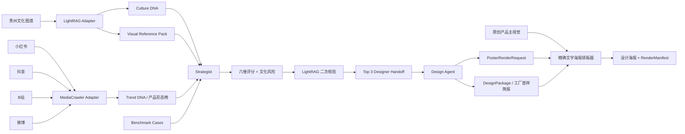

<p align="center">
  
</p>

<p align="center">
  <strong>把贵州非遗的文化证据、市场信号与概念设计，连接成一条可追溯的产品创新链路。</strong><br>
  <sub>An evidence-grounded pipeline from Guizhou cultural knowledge to market-aware, manufacturable product concepts.</sub>
</p>

<p align="center">
  
  
  
  
</p>

<p align="center">
  <a href="#核心能力">核心能力</a> ·
  <a href="#成果展示">成果展示</a> ·
  <a href="#快速开始">快速开始</a> ·
  <a href="#系统架构">系统架构</a> ·
  <a href="#可信边界">可信边界</a> ·
  <a href="#文档地图">文档地图</a>
</p>

> [!IMPORTANT]
> QianCraft 当前是可运行的研究原型：输出可用于概念展示、工厂报价与首样沟通，但不是生产工程图、合规证书、商业文化授权或“爆款保证”。

## 一眼看懂

QianCraft 解决的不是“给传统纹样套一个商品壳”，而是如何把文化出处、地域差异、当下市场信号、设计判断和制造假设放进同一个可审计流程。系统从贵州文化知识图谱出发，经过四平台市场归一化、双证据锁定的机会评分和 LightRAG 二次核验，最终由 Design Agent 形成一个完整的概念设计包与艺术化海报。

| 文化证据 | 市场证据 | 设计交付 | 可审计性 |
|---|---|---|---|
| 22 条结构化文化记录<br>32 条文化/伦理/法律/视觉来源 | 378 条四平台真实快照<br>平台内热度 + 跨平台形态榜 | Top 3 机会 → 1 个主概念<br>尺寸、BOM、装配、质检、海报 | 13 个正式输出<br>输入与渲染 SHA-256、逐组件状态 |

## 核心能力

| 能力 | QianCraft 的做法 |
|---|---|
| **证据锁定的文化理解** | Culture DNA 保留花溪挑花、剑河锡绣、松桃苗绣与雷山工艺差异；每项事实都能回到 `Cxxx` 来源。 |
| **四平台市场归一化** | 统一小红书、抖音、B站、微博字段，在平台内部计算热度，再聚合产品形态；缺失互动保持为 0。 |
| **可解释机会选择** | 每个机会必须同时引用文化与市场证据，经过六维评分、文化风险扣分和 LightRAG 二次核验。 |
| **从 JSON 到概念产品** | Design Agent 重新读取 `designer_handoff.json`、校验摘要并输出文化转译、成品形态、尺寸、BOM、工艺和审核门。 |
| **展示与制造信息同屏** | 原创产品主视觉与本地精确中文排版合成 1800 × 2400 海报，同时保留机器可读 DesignPackage。 |
| **诚实的运行状态** | 文化、市场、策划、设计、渲染分别记录 `live / cache / unavailable`；缓存不冒充实时数据。 |

## 成果展示

当前概念样是 **“针格模块｜花溪挑花互动冰箱贴”**：以原创数纱十字网格表达针脚秩序，通过可替换织物面板、封闭磁体和溯源标签验证“可看、可触、可拆换、可追溯”的产品关系。它只转译结构逻辑，不复制完整馆藏纹样。

<p align="center">
  <a href="data/outputs/design_poster.png">
    
  </a>
</p>

| 继续查看 | 文件 |
|---|---|
| 概念设计与工厂首样机器事实源 | [`design_specification.json`](data/outputs/design_specification.json) |
| 人读版设计说明 | [`design_specification.md`](data/outputs/design_specification.md) |
| 海报提示、面板与视觉约束 | [`poster_render_request.json`](data/outputs/poster_render_request.json) |
| 海报和主视觉摘要 | [`design_render_manifest.json`](data/outputs/design_render_manifest.json) |

## 快速开始

前置条件：Git、[uv](https://docs.astral.sh/uv/) 与 Python 3.11+。项目在 Windows、PowerShell、CPython 3.13 上完成实机验收。

```powershell
uv venv --python 3.13
uv pip install -e ".[test]"
uv run python scripts/run_demo.py --mode demo
```

`demo` 模式不调用外部 API，也不会打开浏览器；它会使用结构化图谱与明确标记的本地证据完成端到端验收。默认主题为“贵州苗绣”，结果写入 `data/outputs/`。

接入项目内原创产品主视觉：

```powershell
uv run python scripts/run_demo.py --mode auto `
  --design-hero data\design\assets\huaxi_grid_magnet_hero_v1.png
```

只重跑 Designer Handoff 之后的设计链路：

```powershell
uv run python scripts/run_design_agent.py `
  --hero-image data\design\assets\huaxi_grid_magnet_hero_v1.png `
  --update-run-manifest
```

## 系统架构



关键接口不是内存对象，而是已落盘的 [`designer_handoff.json`](data/outputs/designer_handoff.json)。Design Agent 会重新载入 Pydantic 契约并记录文件 SHA-256，避免策划与设计之间出现不可追踪的旁路输入。

### 组件与输出

| 组件 | 输入 | 主要输出 | 强制保证 |
|---|---|---|---|
| Culture Knowledge | 文化图谱、视觉来源 | Culture DNA、Visual Reference Pack | 地域/支系不混用，事实有来源 |
| Market Research | 公开基线、授权平台数据 | Trend DNA、产品形态榜 | 缺失值不推测，缓存不冒充实时 |
| Strategist | Culture + Trend + Benchmark | 机会池、Top 3 Handoff | 每项同时具备 `Cxxx` 与 `Mxxx` |
| Design Agent | 文件级 Designer Handoff | DesignPackage、PosterRenderRequest | 主机会来自 Top 3，高敏感母题留置审核 |
| Poster Renderer | DesignPackage、可选原创主视觉 | PNG、RenderManifest | 精确文字本地绘制，参考图像像素禁用 |

### 运行模式

| 模式 | 外部调用 | 失败策略 | 适用场景 |
|---|---|---|---|
| `demo` | 无 API、无浏览器 | 使用明确标记的本地证据 | 开发、演示、离线验收 |
| `auto` | 尝试 LightRAG 与 DeepSeek；市场抓取仍需显式授权 | 允许诚实降级 | 默认实机运行 |
| `live` | 要求策划模型成功 | 关键上游失败即报错 | 严格集成验证 |

## 完整安装与实机接入

<details>
<summary><strong>LightRAG 与 GPT Researcher</strong></summary>

```powershell
uv pip install -e ".\local_culture\LightRAG-main"
uv pip install -e ".\researcher_agent\gpt-researcher-main"
```

复制 `.env.example` 为 `.env`，填写自己的 OpenAI-compatible API 配置后验证：

```powershell
uv run python scripts/check_environment.py --probe-api
uv run python scripts/check_environment.py --probe-mediacrawler
```

不要把 API Key 写入源码、README、命令行参数或提交记录。

</details>

<details>
<summary><strong>四平台研究数据适配</strong></summary>

> [!CAUTION]
> MediaCrawler 的上游许可证仅允许非商业学习/研究。商业化前必须取得书面授权或替换为具备适当商业许可与平台授权的数据实现。

MediaCrawler 使用独立环境，避免其固定依赖污染主运行时：

```powershell
uv venv --python 3.13 ".\market-intel_agent\MediaCrawler-main\.venv-qiancraft"
uv pip install --python ".\market-intel_agent\MediaCrawler-main\.venv-qiancraft\Scripts\python.exe" `
  -r ".\market-intel_agent\MediaCrawler-main\requirements.txt"
```

无交互状态探针不会打开浏览器：

```powershell
uv run python scripts/probe_market_platforms.py
```

首次授权必须由本人逐个平台显式执行；将 `xhs` 依次替换为 `dy`、`bili`、`wb`：

```powershell
uv run python scripts/probe_market_platforms.py --platform xhs --method cdp --authorize
```

四个平台完成授权后，再做正式小规模复核：

```powershell
uv run python scripts/probe_market_platforms.py --platform all --method cdp --formal --authorize
```

项目不绕过验证码、风控、访问控制或平台登录机制。CDP 会话通常可复用，但退出登录、Cookie 过期、平台风控或资料目录清理后仍需本人重新授权。

</details>

## 正式输出

一次完整运行写出 13 个路径：

| 阶段 | 机器事实源 | 人读/展示产物 |
|---|---|---|
| 设计前策略 | `pre_design_strategy.json` | `pre_design_strategy.md` |
| 视觉研究 | `visual_reference_pack.json` | `visual_reference_pack.md` |
| 策划交接 | `designer_handoff.json` | `designer_handoff.md` |
| 市场形态 | `product_form_hotness.json` | — |
| 概念设计 | `design_specification.json` | `design_specification.md` |
| 海报请求 | `poster_render_request.json` | — |
| 海报渲染 | `design_render_manifest.json` | `design_poster.png` |
| 全链路 | `run_manifest.json` | — |

所有 JSON 均由 [`app/schemas.py`](app/schemas.py) 中的 Pydantic 契约约束。RunManifest 记录五个组件、四个平台的登录/搜索状态与全部输出路径。

## 项目结构

```text
QianCraft/
├── app/
│   ├── adapters/          # LightRAG / MediaCrawler / GPT Researcher 隔离层
│   ├── strategist/        # 双证据锁、评分与 Designer Handoff
│   ├── designer/          # Design Agent、工厂简报与海报排版
│   ├── pipeline.py        # 端到端编排和原子输出
│   └── schemas.py         # 全系统唯一数据契约
├── data/
│   ├── culture/           # 贵州文化图谱、视觉参考、LightRAG 存储
│   ├── market/            # raw 平台快照与 derived 派生证据
│   ├── design/assets/     # 原创产品主视觉
│   └── outputs/           # 最新 13 项正式结果
├── scripts/               # Demo、Design Agent、环境与授权入口
├── tests/                 # 契约、证据、降级与端到端回归
├── docs/                  # 架构、图谱、市场、设计与实机报告
└── WORKFLOW.md            # 当前状态与只追加更新台账
```

三个上游源码目录保持原名和原许可证，QianCraft 自有编排位于根目录产品层。这样既能保留供应链与许可证审计，也能在后续升级或替换上游实现。

## 可信边界

| 边界 | 项目约束 |
|---|---|
| **文化事实** | 大模型只能提出假设，不能覆盖知识图谱事实；高敏感叙事进入社区/人工审核。 |
| **视觉权利** | `reference_only` 馆藏图只供研究，不作为生成输入、贴图或描摹底图；未测色时不伪造 HEX。 |
| **市场真实性** | `live / cache / unavailable` 和 `authorized / missing / expired` 分开记录；不推测缺失互动或销量。 |
| **设计成熟度** | 当前尺寸、材料和公差只供报价与首样讨论；`mass_production_ready=false`。 |
| **第三方许可** | 不删除上游声明；MediaCrawler 不得直接用于商业抓取。 |

文化转译遵循共同创作、明确署名、透明授权、公平收益和持续知情同意。花溪首版概念仍需具体合作社区或保护单位确认商品化边界、地域/工艺表述、署名、收益和撤回机制。

## 验证

```powershell
uv run pytest
uvx ruff check app scripts tests
```

当前基线：

```text
19 passed
All checks passed!
```

最新完整业务运行号为 `20260827T225611Z-4f2a77ae`；五组件状态为 `live / cache / live / live / live`。详细的 API、运行时、四平台与契约证据见 [`docs/real_machine_test.md`](docs/real_machine_test.md)。

## 文档地图

| 文档 | 内容 |
|---|---|
| [`WORKFLOW.md`](WORKFLOW.md) | 项目唯一工作流、当前状态与每次更新台账 |
| [`docs/architecture.md`](docs/architecture.md) | 模块边界、证据锁、降级与设计接口 |
| [`docs/design_agent.md`](docs/design_agent.md) | 选案、制造拆解、海报渲染与量产前门禁 |
| [`docs/knowledge_graph.md`](docs/knowledge_graph.md) | 22 条贵州文化记录、32 条来源与田野空白 |
| [`docs/market_intelligence.md`](docs/market_intelligence.md) | 四平台字段、Platform Hot Score 与跨平台公式 |
| [`docs/real_machine_test.md`](docs/real_machine_test.md) | API、三上游运行时、测试与实机验收 |
| [`docs/product_direction.md`](docs/product_direction.md) | 当前概念样与后续产品、交互、共创空间 |
| [`THIRD_PARTY_NOTICES.md`](THIRD_PARTY_NOTICES.md) | 上游来源、许可证差异与商业化要求 |

## 路线图

- 与花溪具体合作社区/保护单位共同审核首版转译、署名、收益与撤回机制。
- 开展用户测试和工厂首样，验证磁体封装、吸附力、卡合循环、绣线耐磨与跌落。
- 在确定销售年龄和地区后补齐材料、标签、包装、适用标准与 DFM。
- 为 QianCraft 自有代码层确定公开发布许可证，并补充 CI、贡献指南与安全报告入口。

## 参与项目

修改前请先阅读 [`AGENTS.md`](AGENTS.md) 和 [`WORKFLOW.md`](WORKFLOW.md)。任何有效更新都必须同步维护当前状态与追加式更新日志，并运行与风险相称的测试。文化数据、市场证据、视觉权利和生产成熟度边界不能为了演示效果而放宽。

## 许可证与第三方组件

LightRAG、MediaCrawler 与 GPT Researcher 保留在独立上游目录中，详细许可与处理方式见 [`THIRD_PARTY_NOTICES.md`](THIRD_PARTY_NOTICES.md)。当前仓库尚未为 QianCraft 自有代码层声明独立的公开许可证；在许可证确定前，本 README 不授予额外复制、分发或商业使用权。

---

<p align="center">
  <strong>QianCraft｜让文化出处、市场判断与设计决策同时可见。</strong>
</p>
