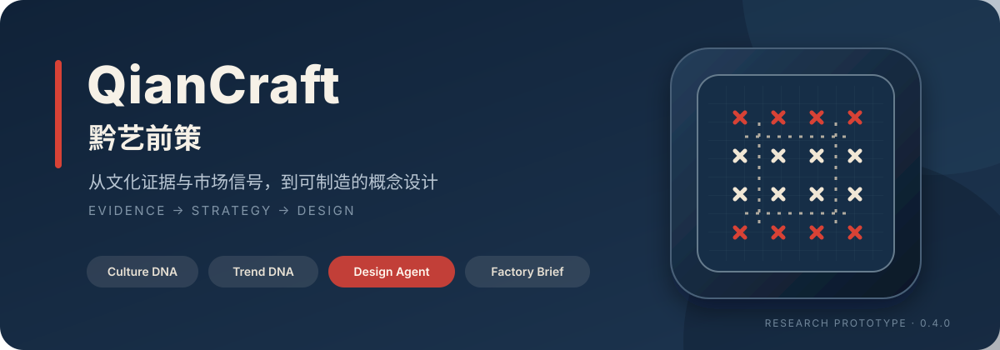
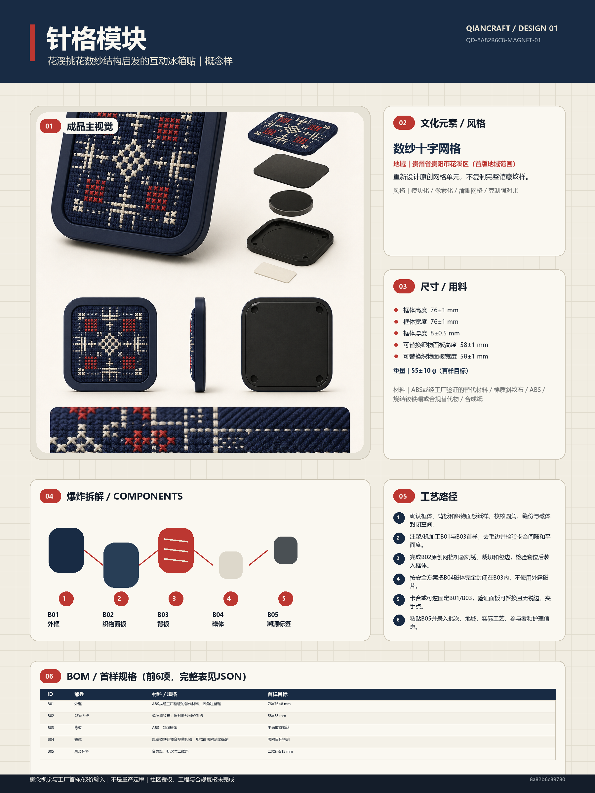
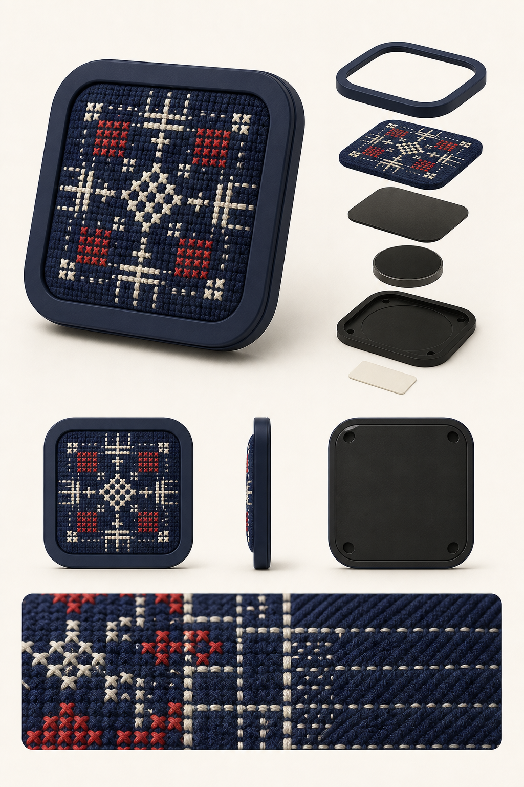
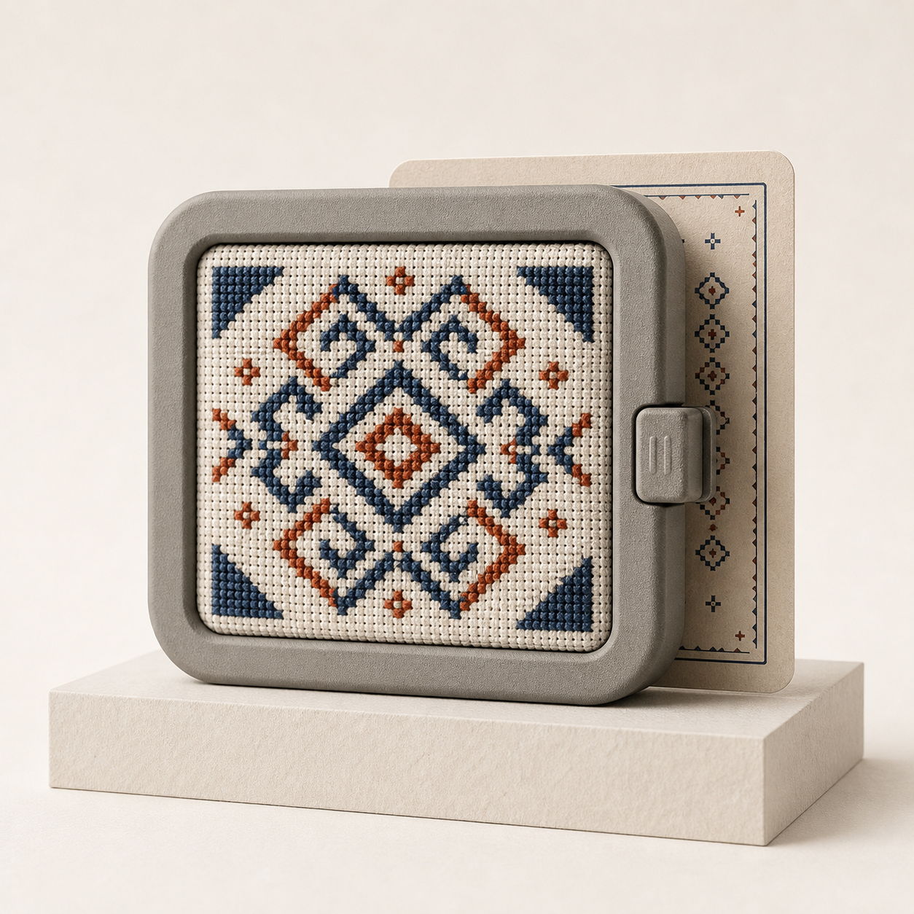
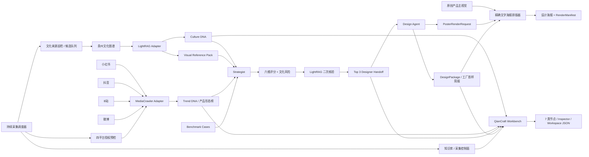

<p align="center">
  
</p>

<p align="center">
  <strong>把贵州非遗的文化证据、市场信号与概念设计，连接成一条可追溯的产品创新链路。</strong><br>
  <sub>An evidence-grounded pipeline from Guizhou cultural knowledge to market-aware, manufacturable product concepts.</sub>
</p>

<p align="center">
  
  
  
  
</p>

<p align="center">
  <a href="#核心能力">核心能力</a> ·
  <a href="#成果展示">成果展示</a> ·
  <a href="#快速开始">快速开始</a> ·
  <a href="#系统架构">系统架构</a> ·
  <a href="#可信边界">可信边界</a> ·
  <a href="#文档地图">文档地图</a>
</p>

> [!IMPORTANT]
> QianCraft 当前是可运行的研究原型：输出可用于概念展示、工厂报价与首样沟通，但不是生产工程图、合规证书、商业文化授权或“爆款保证”。

受保护的在线工作台：[qiancraft-studio-2026.zeabur.app](https://qiancraft-studio-2026.zeabur.app)。线上当前已验收 0.9.1，0.9.2 正在发布前复验；入口启用 Basic Auth，访问凭证由项目维护者单独提供。运行态工作区写入 Zeabur 持久卷，密钥只由服务器变量注入，不进入前端或仓库。当前独立图像 provider 与四平台授权采集运行时尚未接通，因此 A/B/C 已有资产、工作台、人工决策、Design Agent、DesignPackage 与海报可直接使用，图片重生成和严格实时研究会显示真实阻断状态。

## 一眼看懂

QianCraft 解决的不是“给传统纹样套一个商品壳”，而是如何把文化出处、地域差异、当下市场信号、设计判断和制造假设放进同一个可审计流程。系统从贵州文化知识图谱出发，持续巡检公开文化来源与四平台授权条件，经过市场归一化、双证据锁定的机会评分和 LightRAG 二次核验，最终由 Design Agent 形成一个完整的概念设计包与艺术化海报。

| 文化证据 | 市场证据 | 空间工作台 | 设计交付 |
|---|---|---|---|
| 22 条结构化文化记录<br>32 条登记来源 + 独立候选审核 | 378 条四平台真实快照<br>授权增量采集 + 跨平台形态榜 | 9 个实例 / 7 类节点、独立展示页、Inspector<br>工作区 JSON 可持久保存 | Top 3 机会 → A/B/C 概念<br>尺寸、BOM、装配、质检、可编辑海报 |

## 核心能力

| 能力 | QianCraft 的做法 |
|---|---|
| **证据锁定的文化理解** | Culture DNA 保留花溪挑花、剑河锡绣、松桃苗绣与雷山工艺差异；每项事实都能回到 `Cxxx` 来源。 |
| **四平台市场归一化** | 统一小红书、抖音、B站、微博字段，在平台内部计算热度，再聚合产品形态；缺失互动保持为 0。 |
| **可解释机会选择** | 每个机会必须同时引用文化与市场证据，经过六维评分、文化风险扣分和 LightRAG 二次核验。 |
| **从 JSON 到概念产品** | Design Agent 重新读取 `designer_handoff.json`、校验摘要并输出文化转译、成品形态、尺寸、BOM、工艺和审核门。 |
| **展示与制造信息同屏** | 原创产品主视觉与本地精确中文排版合成 1800 × 2400 海报，同时保留机器可读 DesignPackage。 |
| **空间化创作工作台** | 五阶段导航、按需证据/资产/历史 Dock、文化图谱、四平台雷达、机会策略、设计任务书、A/B/C 概念视觉与海报板在同一无限画布中编排；Inspector 只显示当前节点的参数、来源、历史和动作。 |
| **文化关系星图** | 22 条正式记录、32 个来源与分类引力点组成可搜索、选点、拖动、缩放和键盘操作的星图；触屏默认保留页面滚动，显式进入操作模式后支持单指平移与双指缩放。 |
| **持续素材采集** | 文化来源默认每 6 小时巡检并只产生待核验候选；市场默认每 4 小时复检四平台授权，只有完整 `live_verified` 才晋级。暂停、间隔、立即运行、失败与心跳均可见。 |
| **七阶段人工决策** | 人工可选择文化记录、平台/品类、六维评分权重与候选机会，并继续指定设计意图、视觉参照、概念比较组和海报结构；每次保存形成独立版本，不覆盖事实原件。 |
| **九节点专业展示页** | 每个实例可单击或双击进入独立页面；文化关系、市场原记录、六维量分、任务书、视觉提示、概念成品、BOM 和海报分别拥有专用视图，并附可回到原始网页的证据台账。 |
| **Tonal Focus 工具界面** | 暖矿物外壳、雾蓝画布、灰绿工具区、暖陶 Inspector 与浅石节点构成固定功能色块；低饱和深灰蓝只承担选中、焦点和主动作，黑色星图仅作为关系画布例外。 |
| **诚实的运行状态** | 文化、市场、策划、设计、渲染分别记录 `live / cache / unavailable`；缓存不冒充实时数据。 |
| **可恢复的真实任务** | “实时运行”会在服务端创建持久化后台任务，页面刷新后自动续接轮询；只有文化、策划和四平台全部为本轮 `live` 才会晋级并回写当前工作区。 |

## 成果展示

当前概念样是 **“针格模块｜花溪挑花互动冰箱贴”**：以原创数纱十字网格表达针脚秩序，通过可替换织物面板、封闭磁体和溯源标签验证“可看、可触、可拆换、可追溯”的产品关系。它只转译结构逻辑，不复制完整馆藏纹样。

<p align="center">
  <a href="data/outputs/design_poster.png">
    
  </a>
</p>

三条方向在同一任务书下保持不同产品定位：A 验证核心结构，B 收敛轻量礼赠，C 扩展为可收藏的替换面板系统。

| Concept A · 核心结构 | Concept B · 轻量礼赠 | Concept C · 系列收藏 |
|---|---|---|
|  |  |  |

| 继续查看 | 文件 |
|---|---|
| 概念设计与工厂首样机器事实源 | [`design_specification.json`](data/outputs/design_specification.json) |
| 人读版设计说明 | [`design_specification.md`](data/outputs/design_specification.md) |
| 海报提示、面板与视觉约束 | [`poster_render_request.json`](data/outputs/poster_render_request.json) |
| 海报和主视觉摘要 | [`design_render_manifest.json`](data/outputs/design_render_manifest.json) |

## 快速开始

前置条件：Git、Conda、Node.js 22 与 Corepack。仓库统一使用 `environment.yml` 创建 Python 3.13 环境，不直接调用本机 Python。

```powershell
conda env create -f environment.yml
conda run --no-capture-output -n qiancraft python scripts/run_demo.py --mode demo
```

`demo` 模式不调用外部 API，也不会打开浏览器；它会使用结构化图谱与明确标记的本地证据完成端到端验收。默认主题为“贵州苗绣”，结果写入 `data/outputs/`。

### 启动 Creative Intelligence Workbench

工作台前端通过 HTTP 读取真实 Python API，不在浏览器里复制一套假数据。分别启动两个终端：

```powershell
# Terminal 1 · QianCraft API
conda run --no-capture-output -n qiancraft python -m app.tool_api --port 8787

# Terminal 2 · Web Workbench
cd web
pnpm install
pnpm dev
```

打开 `http://localhost:3000`。默认工作区会载入“贵州苗绣 → 四平台市场雷达 → 策略 → 任务书 → 视觉 A/B/C → 海报”的完整链路，三套概念视觉均可直接比较；画布位置、视口、当前概念、编辑版本、后台任务和设计运行保存在被 Git 忽略的 `data/runtime/`。容器部署继续把同一路径映射到 `/app/data/runtime` 持久卷，证据基线不会被用户操作覆盖。

Tool API 启动时也会启动持续采集调度器。文化图谱页提供来源巡检、候选审核与知识星图；市场页先展示 378 条历史证据和时间窗，再提供可展开的授权/增量采集控制面。默认配置为：

```dotenv
QIANCRAFT_CONTINUOUS_COLLECTION=true
QIANCRAFT_CULTURE_WATCH_MINUTES=360
QIANCRAFT_MARKET_REFRESH_MINUTES=240
```

持续运行要求 API/容器常驻、异常自动重启、`data/runtime/` 持久卷和真实网络；市场通道还要求维护者本人完成 xhs / dy / bili / wb 授权并显式开启实时采集。缺少任何条件时页面会显示 blocked/offline，不会拿历史数据假装正在更新。详见 [`docs/continuous_collection.md`](docs/continuous_collection.md)。

顶部“实时运行”不是演示按钮：它会执行 LightRAG 检索、四平台授权采集和模型策划，并轮询服务端任务。页面刷新或重新打开后会自动续接；任何平台未返回本轮真实记录时，该轮明确失败且不会拿历史快照回写。研究节点的单独“运行”也不会用读取旧文件伪造一次新成功。

需要以已构建的 production server 使用网站时，在 `web` 目录执行 `pnpm build` 后运行 `pnpm start:local`；它只绑定 `127.0.0.1:3000`，并继续使用同一真实 API。

### 备份与恢复运行态

快照包含 Workspace、严格研究任务、采集排程/事件/候选和生成资产，不包含 Secret。备份文件必须放在运行态目录之外；权威备份和恢复前都应停止 Tool API 写入。脚本会在发布 ZIP 前自校验路径、文件数、体积与 SHA-256，并在恢复时保留原目录作为回滚副本。

```powershell
conda run --no-capture-output -n qiancraft python scripts/runtime_snapshot.py backup `
  --runtime-root data/runtime --output ..\qiancraft-backups\runtime.zip
conda run --no-capture-output -n qiancraft python scripts/runtime_snapshot.py verify `
  ..\qiancraft-backups\runtime.zip
conda run --no-capture-output -n qiancraft python scripts/runtime_snapshot.py restore `
  ..\qiancraft-backups\runtime.zip --runtime-root data/runtime `
  --confirm-service-stopped --confirm RESTORE_QIANCRAFT_RUNTIME
```

每张节点卡都可以进入完整展示页，双击节点也可直达；详情页支持独立运行、从此处运行、编辑保存、结构化导出和相邻节点跳转。文化、市场与策略页会把 `Cxxx / Mxxx / MPL-xxx / Vxxx` 解析为完整引用卡，并区分事实来源、平台历史记录、视觉研究参考和策略推导。

画布右上角的 Flow Map 可直接定位文化、市场、策略、任务书、A/B/C 与海报节点，不必手动在大画布中寻找。若网站前端与 API 不在同一台机器，把 `web/.env.example` 复制为 `web/.env.local`，设置 `NEXT_PUBLIC_QIANCRAFT_API_URL`；需要覆盖公开站点元数据时设置 `NEXT_PUBLIC_QIANCRAFT_SITE_URL`。这两个公开变量只能放 URL，不能放任何密钥。

项目已内置本轮确认过的 A/B/C 概念资产。后续一键生成或单方向重生成使用独立适配器：只有同时配置 `IMAGE_PROVIDER`、`IMAGE_API_KEY`、`IMAGE_BASE_URL` 与 `IMAGE_MODEL` 时才会启用；缺项会在节点与 Inspector 中明确显示 `warning`，不会把既有资产冒充为新调用结果。

接入项目内原创产品主视觉：

```powershell
conda run --no-capture-output -n qiancraft python scripts/run_demo.py --mode auto `
  --design-hero data\design\assets\huaxi_grid_magnet_hero_v1.png
```

只重跑 Designer Handoff 之后的设计链路：

```powershell
conda run --no-capture-output -n qiancraft python scripts/run_design_agent.py `
  --hero-image data\design\assets\huaxi_grid_magnet_hero_v1.png `
  --update-run-manifest
```

## 系统架构



关键接口不是内存对象，而是已落盘的 [`designer_handoff.json`](data/outputs/designer_handoff.json)。Design Agent 会重新载入 Pydantic 契约并记录文件 SHA-256，避免策划与设计之间出现不可追踪的旁路输入。

### 组件与输出

| 组件 | 输入 | 主要输出 | 强制保证 |
|---|---|---|---|
| Culture Knowledge | 文化图谱、视觉来源 | Culture DNA、Visual Reference Pack | 地域/支系不混用，事实有来源 |
| Market Research | 公开基线、授权平台数据 | Trend DNA、产品形态榜 | 缺失值不推测，缓存不冒充实时 |
| Strategist | Culture + Trend + Benchmark | 机会池、Top 3 Handoff | 每项同时具备 `Cxxx` 与 `Mxxx` |
| Design Agent | 文件级 Designer Handoff | DesignPackage、PosterRenderRequest | 主机会来自 Top 3，高敏感母题留置审核 |
| Poster Renderer | DesignPackage、可选原创主视觉 | PNG、RenderManifest | 精确文字本地绘制，参考图像像素禁用 |
| Creative Workbench | 文化、市场、策略、DesignPackage、图像适配器 | 空间画布、版本化任务书、A/B/C、可编辑海报 | 前端仅经 HTTP API 读写；上游更新只标记下游 stale |
| Continuous Collection | 登记文化来源、四平台授权与严格研究任务 | 心跳、候选队列、来源指纹、增量运行审计 | 文化候选不自动入图；四平台非全 live 不晋级 |

### 运行模式

| 模式 | 外部调用 | 失败策略 | 适用场景 |
|---|---|---|---|
| `demo` | 无 API、无浏览器 | 使用明确标记的本地证据 | 开发、演示、离线验收 |
| `auto` | 尝试 LightRAG 与 DeepSeek；市场抓取仍需显式授权 | 允许诚实降级 | 默认实机运行 |
| `live` | 要求策划模型成功 | 关键上游失败即报错 | 严格集成验证 |

## 完整安装与实机接入

<details>
<summary><strong>LightRAG 与 GPT Researcher</strong></summary>

```powershell
conda run --no-capture-output -n qiancraft python -m pip install -e ".\local_culture\LightRAG-main"
conda run --no-capture-output -n qiancraft python -m pip install -e ".\researcher_agent\gpt-researcher-main"
```

复制 `.env.example` 为 `.env`，填写自己的 OpenAI-compatible API 配置后验证：

```powershell
conda run --no-capture-output -n qiancraft python scripts/check_environment.py --probe-api
conda run --no-capture-output -n qiancraft python scripts/check_environment.py --probe-mediacrawler
```

不要把 API Key 写入源码、README、命令行参数或提交记录。

</details>

<details>
<summary><strong>四平台研究数据适配</strong></summary>

> [!CAUTION]
> MediaCrawler 的上游许可证仅允许非商业学习/研究。商业化前必须取得书面授权或替换为具备适当商业许可与平台授权的数据实现。

MediaCrawler 使用独立 Conda 环境，避免其固定依赖污染主运行时；创建后把该环境 Python 的绝对路径写入被忽略的 `.env` 中的 `MEDIACRAWLER_PYTHON`：

```powershell
conda create -n qiancraft-mediacrawler python=3.13 pip -y
conda run --no-capture-output -n qiancraft-mediacrawler python -m pip install `
  -r ".\market-intel_agent\MediaCrawler-main\requirements.txt"
```

无交互状态探针不会打开浏览器：

```powershell
conda run --no-capture-output -n qiancraft python scripts/probe_market_platforms.py
```

首次授权必须由本人逐个平台显式执行；将 `xhs` 依次替换为 `dy`、`bili`、`wb`：

```powershell
conda run --no-capture-output -n qiancraft python scripts/probe_market_platforms.py --platform xhs --method cdp --authorize
```

四个平台完成授权后，再做正式小规模复核：

```powershell
conda run --no-capture-output -n qiancraft python scripts/probe_market_platforms.py --platform all --method cdp --formal --authorize
```

项目不绕过验证码、风控、访问控制或平台登录机制。CDP 会话通常可复用，但退出登录、Cookie 过期、平台风控或资料目录清理后仍需本人重新授权。

</details>

## 正式输出

一次完整运行写出 13 个路径：

| 阶段 | 机器事实源 | 人读/展示产物 |
|---|---|---|
| 设计前策略 | `pre_design_strategy.json` | `pre_design_strategy.md` |
| 视觉研究 | `visual_reference_pack.json` | `visual_reference_pack.md` |
| 策划交接 | `designer_handoff.json` | `designer_handoff.md` |
| 市场形态 | `product_form_hotness.json` | — |
| 概念设计 | `design_specification.json` | `design_specification.md` |
| 海报请求 | `poster_render_request.json` | — |
| 海报渲染 | `design_render_manifest.json` | `design_poster.png` |
| 全链路 | `run_manifest.json` | — |

所有 JSON 均由 [`app/schemas.py`](app/schemas.py) 中的 Pydantic 契约约束。RunManifest 记录五个组件、四个平台的登录/搜索状态与全部输出路径。

## 项目结构

```text
QianCraft/
├── app/
│   ├── adapters/          # LightRAG / MediaCrawler / GPT Researcher 隔离层
│   ├── strategist/        # 双证据锁、评分与 Designer Handoff
│   ├── designer/          # Design Agent、工厂简报与海报排版
│   ├── collection.py      # 文化巡检、候选队列与市场增量调度器
│   ├── workbench.py       # 7 类节点、工作区持久化、版本与运行语义
│   ├── pipeline.py        # 端到端编排和原子输出
│   └── schemas.py         # 全系统唯一数据契约
├── data/
│   ├── culture/           # 贵州文化图谱、视觉参考、LightRAG 存储
│   ├── market/            # raw 平台快照与 derived 派生证据
│   ├── design/assets/     # 原创产品主视觉
│   ├── workbench/         # 工作区 JSON 与受控生成图
│   └── outputs/           # 最新 13 项正式结果
├── web/                   # Tonal Focus 工作台、知识星图、采集控制面与节点详情
├── scripts/               # Demo、Design Agent、环境、授权与运行态快照入口
├── tests/                 # 契约、证据、安全、恢复、降级与端到端回归
├── docs/                  # 架构、图谱、市场、设计与实机报告
├── PRODUCT.md             # 产品定位、用户任务、成功标准与边界
├── DESIGN.md              # 可执行界面令牌、组件与响应式规范
└── WORKFLOW.md            # 当前状态与只追加更新台账
```

三个上游源码目录保持原名和原许可证，QianCraft 自有编排位于根目录产品层。这样既能保留供应链与许可证审计，也能在后续升级或替换上游实现。

## 可信边界

| 边界 | 项目约束 |
|---|---|
| **文化事实** | 大模型只能提出假设，不能覆盖知识图谱事实；高敏感叙事进入社区/人工审核。 |
| **视觉权利** | `reference_only` 馆藏图只供研究，不作为生成输入、贴图或描摹底图；未测色时不伪造 HEX。 |
| **市场真实性** | `live / cache / unavailable` 和 `authorized / missing / expired` 分开记录；不推测缺失互动或销量。 |
| **设计成熟度** | 当前尺寸、材料和公差只供报价与首样讨论；`mass_production_ready=false`。 |
| **第三方许可** | 不删除上游声明；MediaCrawler 不得直接用于商业抓取。 |

文化转译遵循共同创作、明确署名、透明授权、公平收益和持续知情同意。花溪首版概念仍需具体合作社区或保护单位确认商品化边界、地域/工艺表述、署名、收益和撤回机制。

## 验证

```powershell
conda run --no-capture-output -n qiancraft python -m pytest -q
conda run --no-capture-output -n qiancraft ruff check .
conda run --no-capture-output -n qiancraft uv lock --check
conda run --no-capture-output -n qiancraft python -m pip_audit --local
cd web
pnpm audit --audit-level=high
pnpm test
pnpm typecheck
pnpm lint
pnpm exec playwright test --project=desktop-chromium
pnpm build
```

当前基线：

```text
77 Python tests passed
5 Web tests passed
30 desktop functional Playwright tests passed on macOS; 1 Windows canonical visual test skipped
0 known Python or pnpm dependency vulnerabilities
All checks passed!
```

当前正式基线运行号为 `20260828T060200Z-e44240e3`：LightRAG、DeepSeek 策略调用、Design Agent 与 Poster Renderer 均为 `live`，市场层使用 378 条历史真实快照并标记为 `cache`。该轮模型建议的正式接受数为 `generated_opportunities_accepted=0`，所以当前 8 条机会全部来自证据规则基线，不能写成 DeepSeek 生成。Workbench 的“实时运行”不会直接复用这份基线：它会新建隔离后台任务并实际访问上游，四平台任一项不是本轮 `live` 就保留失败审计而不回写旧结果；详细的 API、运行时、实爬与契约证据见 [`docs/real_machine_test.md`](docs/real_machine_test.md)。

## 文档地图

| 文档 | 内容 |
|---|---|
| [`WORKFLOW.md`](WORKFLOW.md) | 项目唯一工作流、当前状态与每次更新台账 |
| [`PRODUCT.md`](PRODUCT.md) | 工具定位、核心用户任务、当前能力与非量产边界 |
| [`DESIGN.md`](DESIGN.md) | Tonal Focus 功能色块、星图/控制面、布局、组件、可访问性与视觉禁区 |
| [`docs/continuous_collection.md`](docs/continuous_collection.md) | 文化巡检、候选门、四平台增量排程、状态/API 与 7×24 运行条件 |
| [`docs/architecture.md`](docs/architecture.md) | 模块边界、证据锁、降级与设计接口 |
| [`docs/human_decision_workflow.md`](docs/human_decision_workflow.md) | 七阶段人工决策、版本语义、API 与下游失效规则 |
| [`docs/typography_system.md`](docs/typography_system.md) | Flipbook 调研、中文字体阶梯、画布比例与响应式验收 |
| [`docs/design_agent.md`](docs/design_agent.md) | 选案、制造拆解、海报渲染与量产前门禁 |
| [`docs/knowledge_graph.md`](docs/knowledge_graph.md) | 22 条贵州文化记录、32 条来源与田野空白 |
| [`docs/market_intelligence.md`](docs/market_intelligence.md) | 四平台字段、Platform Hot Score 与跨平台公式 |
| [`docs/real_machine_test.md`](docs/real_machine_test.md) | API、三上游运行时、测试与实机验收 |
| [`docs/product_direction.md`](docs/product_direction.md) | 当前概念样与后续产品、交互、共创空间 |
| [`THIRD_PARTY_NOTICES.md`](THIRD_PARTY_NOTICES.md) | 上游来源、许可证差异与商业化要求 |

## 路线图

- 与花溪具体合作社区/保护单位共同审核首版转译、署名、收益与撤回机制。
- 开展用户测试和工厂首样，验证磁体封装、吸附力、卡合循环、绣线耐磨与跌落。
- 在确定销售年龄和地区后补齐材料、标签、包装、适用标准与 DFM。
- 为 QianCraft 自有代码层确定公开发布许可证，并补充贡献指南、私密安全报告入口与用户级身份审计。

## 参与项目

修改前请先阅读 [`AGENTS.md`](AGENTS.md) 和 [`WORKFLOW.md`](WORKFLOW.md)。任何有效更新都必须同步维护当前状态与追加式更新日志，并运行与风险相称的测试。文化数据、市场证据、视觉权利和生产成熟度边界不能为了演示效果而放宽。

## 许可证与第三方组件

LightRAG、MediaCrawler 与 GPT Researcher 保留在独立上游目录中，详细许可与处理方式见 [`THIRD_PARTY_NOTICES.md`](THIRD_PARTY_NOTICES.md)。当前仓库尚未为 QianCraft 自有代码层声明独立的公开许可证；在许可证确定前，本 README 不授予额外复制、分发或商业使用权。

---

<p align="center">
  <strong>QianCraft｜让文化出处、市场判断与设计决策同时可见。</strong>
</p>
